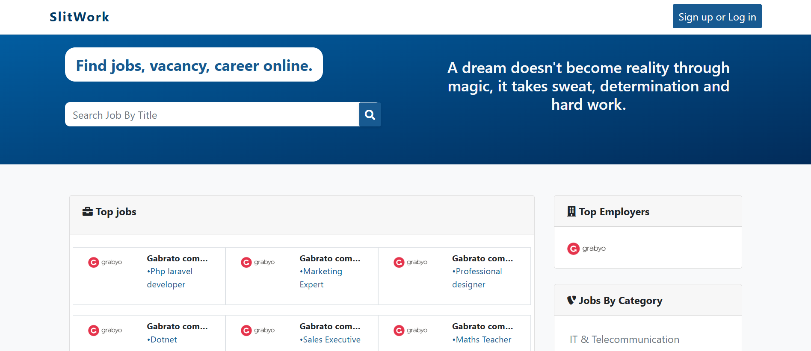
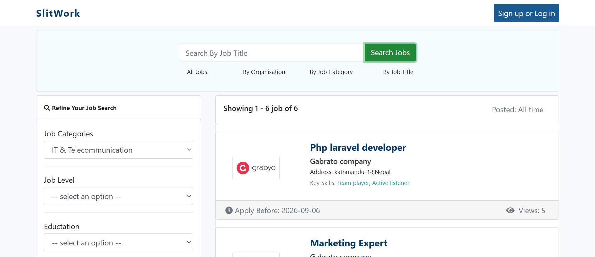
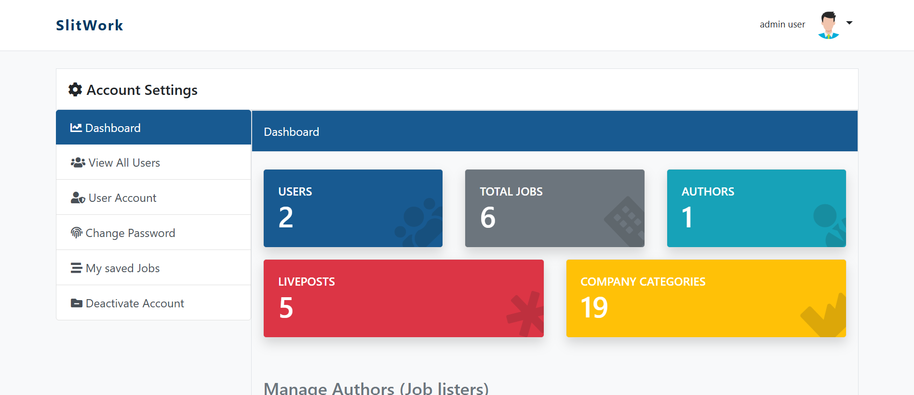

<div align="center">

# SLITWORK -Jobboard

### Job Board Platform untuk Pencari Kerja dan Perusahaan

Slitwork adalah aplikasi web **job board** yang saya kembangkan menggunakan **Laravel dan Vue.js**. Aplikasi ini dibuat untuk mempertemukan pencari kerja dengan perusahaan melalui proses pencarian lowongan, pengelolaan lowongan, hingga pengajuan lamaran.



<br>

[](https://laravel.com)
[](https://php.net)
[](https://vuejs.org)
[](https://www.mysql.com)
[](#lisensi)

</div>

---

## Tentang Slitwork

**Slitwork** merupakan project web yang saya buat sebagai platform pencarian dan pengelolaan lowongan pekerjaan.

Dari sisi pencari kerja, pengguna dapat mencari lowongan berdasarkan kategori, melihat detail pekerjaan, menyimpan lowongan yang menarik, dan mengirim lamaran.

Sedangkan dari sisi perusahaan, pengguna dengan role **Author** dapat mengelola informasi perusahaan, membuat lowongan pekerjaan, mengatur deadline, serta melihat pelamar yang masuk.

Project ini juga memiliki **Admin** yang bertugas mengelola pengguna, role, permission, dan kategori yang digunakan dalam platform.

### Role Pengguna

| Role       | Fungsi                                                                            |
| ---------- | --------------------------------------------------------------------------------- |
| **User**   | Mencari lowongan, melihat detail pekerjaan, menyimpan dan melamar pekerjaan       |
| **Author** | Mengelola profil perusahaan, membuat dan mengelola lowongan serta melihat pelamar |
| **Admin**  | Mengelola pengguna, role, permission, dan kategori                                |

---

## Fitur

### Untuk Pencari Kerja

* Register dan login
* Mencari lowongan pekerjaan
* Filter berdasarkan kategori
* Melihat detail lowongan
* Melamar pekerjaan
* Melihat daftar lamaran
* Menyimpan lowongan sebagai favorit
* Mengubah password
* Menonaktifkan akun

### Untuk Perusahaan

* Mengelola profil perusahaan
* Membuat lowongan pekerjaan
* Mengedit lowongan
* Menghapus lowongan
* Menentukan batas waktu lamaran
* Melihat daftar pelamar
* Mengelola informasi pekerjaan yang dipublikasikan

### Untuk Admin

* Mengelola data pengguna
* Mengelola role
* Mengelola permission
* Mengelola kategori perusahaan/pekerjaan

---

## Tampilan Aplikasi

<table>
<tr>
<td align="center" width="33%">
<br>
<b>Home Page</b>
</td>

<td align="center" width="33%">
<br>
<b>Job Finder</b>
</td>

<td align="center" width="33%">
<br>
<b>Admin Dashboard</b>
</td>
</tr>
</table>

---

## Teknologi yang Digunakan

Project ini menggunakan beberapa teknologi berikut:

| Bagian               | Teknologi                 |
| -------------------- | ------------------------- |
| Framework            | Laravel 12                |
| Backend              | PHP 8.2+                  |
| Frontend             | Blade, Bootstrap          |
| JavaScript Framework | Vue.js 2                  |
| Database             | MySQL 8                   |
| Authentication       | Laravel Fortify           |
| Role & Permission    | Spatie Laravel Permission |
| Alert                | RealRashid Sweet Alert    |
| Package Manager      | Composer & NPM            |

---

## Struktur Role & Permission

Slitwork menggunakan sistem **Role Based Access Control (RBAC)** untuk membatasi akses berdasarkan role pengguna.

```text
User
├── Melihat Lowongan
├── Mencari Lowongan
├── Melamar Pekerjaan
└── Menyimpan Lowongan

Author
├── Mengelola Profil Perusahaan
├── Membuat Lowongan
├── Mengedit Lowongan
├── Menghapus Lowongan
└── Melihat Pelamar

Admin
├── Mengelola User
├── Mengelola Role
├── Mengelola Permission
└── Mengelola Kategori
```

Role dan permission dikelola menggunakan **Spatie Laravel Permission** dan dapat diinisialisasi melalui database seeder.

---

## Alur Aplikasi

Secara sederhana, alur Slitwork dapat digambarkan seperti berikut:

```text
                    SLITWORK
                       │
          ┌────────────┼────────────┐
          │            │            │
          ▼            ▼            ▼
        USER         AUTHOR        ADMIN
          │            │            │
          ▼            ▼            ▼
      Cari Job     Kelola Job    Kelola User
          │            │            │
          ▼            ▼            ▼
     Lihat Detail  Kelola Company  Role & Permission
          │            │            │
          ▼            ▼            ▼
       Apply Job    Lihat Pelamar   Kategori
          │
          ▼
     Simpan Job
```

---

## Instalasi

### Persyaratan

Sebelum menjalankan project, pastikan sudah tersedia:

* PHP 8.2 atau lebih baru
* Composer
* MySQL 8.0 atau lebih baru
* Node.js & NPM
* Git

### 1. Clone Repository

```bash
git clone https://github.com/MaulanaYusufzidan/slitwork.git
cd slitwork
```

### 2. Install Dependency

Install dependency Laravel:

```bash
composer install
```

Kemudian install dependency frontend:

```bash
npm install
```

### 3. Konfigurasi Environment

Copy file `.env.example` menjadi `.env`:

```bash
cp .env.example .env
```

Kemudian generate application key:

```bash
php artisan key:generate
```

### 4. Konfigurasi Database

Buat database baru di MySQL, kemudian sesuaikan konfigurasi pada file `.env`:

```env
DB_DATABASE=slitwork
DB_USERNAME=root
DB_PASSWORD=
```

Sesuaikan `DB_USERNAME` dan `DB_PASSWORD` dengan konfigurasi MySQL di komputer masing-masing.

### 5. Jalankan Migration

```bash
php artisan migrate
```

Jika project menggunakan seeder:

```bash
php artisan db:seed
```

Atau dapat menjalankan migration sekaligus seeder:

```bash
php artisan migrate --seed
```

### 6. Jalankan Frontend

Untuk development:

```bash
npm run dev
```

Untuk production:

```bash
npm run build
```

### 7. Jalankan Laravel

Buka terminal baru dan jalankan:

```bash
php artisan serve
```

Kemudian buka:

```text
http://127.0.0.1:8000
```

---

## Seeder

Project ini menyediakan beberapa seeder untuk membantu proses setup data awal.

Seeder dapat dijalankan dengan:

```bash
php artisan db:seed
```

Jika ingin menjalankan ulang database beserta data awal:

```bash
php artisan migrate:fresh --seed
```

> **Catatan:** `migrate:fresh` akan menghapus seluruh tabel dan data yang ada di database tersebut. Gunakan hanya pada environment development.

---

## Akun Demo

Jika seeder project sudah menyediakan akun bawaan, informasi akun dapat ditambahkan pada bagian ini.

Contoh:

| Role   | Email                | Password   |
| ------ | -------------------- | ---------- |
| Admin  | `admin@example.com`  | `password` |
| Author | `author@example.com` | `password` |
| User   | `user@example.com`   | `password` |

> Sesuaikan data akun di atas dengan akun yang benar-benar tersedia pada `UserSeeder` project.

---

## Tujuan Project

Project **Slitwork** saya buat sebagai salah satu project untuk mengembangkan kemampuan dalam membangun aplikasi web menggunakan Laravel.

Melalui project ini, saya mempelajari beberapa hal seperti:

* Pengembangan aplikasi menggunakan Laravel
* Pembuatan sistem autentikasi
* Pengelolaan database MySQL
* Implementasi role dan permission
* Pengembangan tampilan menggunakan Blade dan Bootstrap
* Penggunaan Vue.js untuk fitur pencarian
* Pengelolaan data lowongan dan lamaran
* Penerapan struktur aplikasi berbasis MVC

Project ini juga menjadi salah satu latihan saya dalam membuat aplikasi yang memiliki beberapa jenis pengguna dengan kebutuhan dan hak akses yang berbeda.

---

## Yang Saya Pelajari

Beberapa bagian yang cukup banyak saya pelajari selama mengerjakan Slitwork adalah bagaimana membuat alur aplikasi berdasarkan role pengguna.

Sebagai contoh, pengguna biasa tidak memiliki akses untuk membuat lowongan, sedangkan **Author** dapat mengelola lowongan miliknya. Admin memiliki akses yang lebih luas untuk mengelola pengguna, permission, dan kategori.

Selain itu, saya juga belajar menggabungkan Laravel sebagai backend dengan Vue.js untuk membuat bagian pencarian lowongan terasa lebih interaktif.

---

## Pengembangan Selanjutnya

Beberapa fitur yang masih dapat dikembangkan dari project ini antara lain:

* Notifikasi untuk status lamaran
* Upload CV dan dokumen pendukung
* Sistem rekomendasi lowongan
* Filter pencarian yang lebih lengkap
* Dashboard statistik untuk perusahaan
* Email notification
* Responsive UI yang lebih optimal
* REST API untuk kebutuhan mobile application

---

## Kontribusi

Project ini dibuat sebagai project pengembangan dan pembelajaran pribadi.

Jika ingin memberikan masukan atau melakukan pengembangan lebih lanjut, silakan melakukan **fork repository** dan membuat pull request.

---

## Lisensi

Project **Slitwork** menggunakan lisensi **MIT**.

---

<div align="center">

### Slitwork

**Job Board Platform**

Dibuat dan dikembangkan oleh **Maulana Yusuf Zidan**

Laravel · Vue.js · MySQL

</div>
